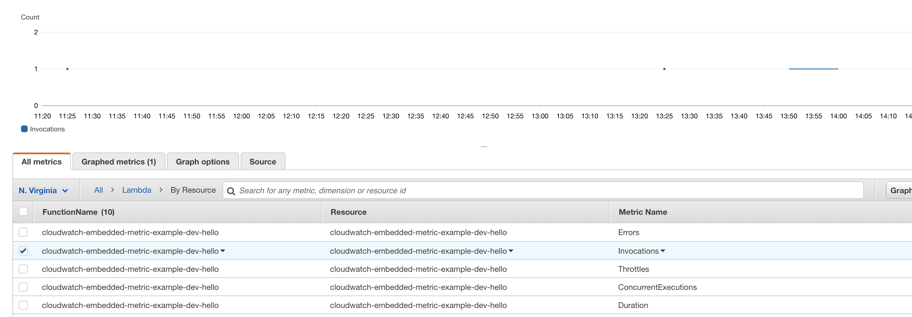
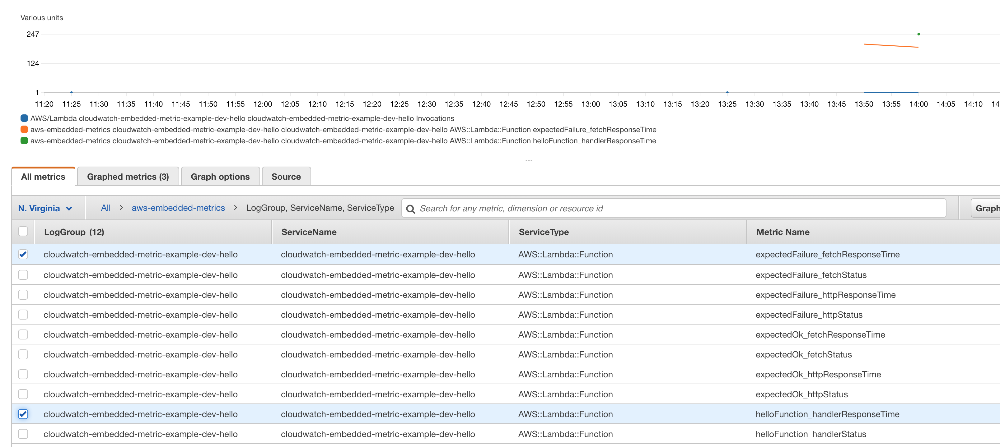
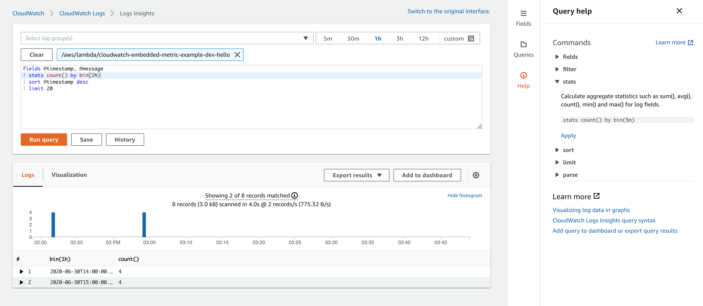

# CloudWatch Embedded Metric Log Format example

TypeScript demonstration of:

* Logging remote fetch calls.
* Using CloudWatch Embedded Metric Format logging.

```shell
$ curl https://xxxxxxx.execute-api.us-east-1.amazonaws.com/dev/hello
{"ok":true}
```

```shell
$ sls logs -f hello
```

```json
{
  "LogGroup": "cloudwatch-embedded-metric-example-dev-hello",
  "ServiceName": "cloudwatch-embedded-metric-example-dev-hello",
  "ServiceType": "AWS::Lambda::Function",
  "executionEnvironment": "AWS_Lambda_nodejs12.x",
  "memorySize": "1024",
  "functionVersion": "$LATEST",
  "logStreamId": "2020/06/30/[$LATEST]7911efa4cd834085934f4b2cb9a708b2",
  "_aws": {
    "Timestamp": 1593525843620,
    "CloudWatchMetrics": [
      {
        "Dimensions": [["LogGroup", "ServiceName", "ServiceType"]],
        "Metrics": [
          { "Name": "expectedFailure_fetchStatus", "Unit": "None" },
          {
            "Name": "expectedFailure_fetchResponseTime",
            "Unit": "Milliseconds"
          },
          { "Name": "expectedOk_fetchStatus", "Unit": "None" },
          { "Name": "expectedOk_fetchResponseTime", "Unit": "Milliseconds" },
          { "Name": "helloFunction_handlerStatus", "Unit": "None" },
          {
            "Name": "helloFunction_handlerResponseTime",
            "Unit": "Milliseconds"
          }
        ],
        "Namespace": "aws-embedded-metrics"
      }
    ]
  },
  "expectedFailure_fetchStatus": 500,
  "expectedFailure_fetchResponseTime": 191.48009,
  "expectedOk_fetchStatus": 200,
  "expectedOk_fetchResponseTime": 54.12774,
  "helloFunction_handlerStatus": 200,
  "helloFunction_handlerResponseTime": 246.77472
}
```

# Metrics

Aside from the standard Lambda metrics:



The new custom metrics are automatically created:



# Logs

Logs can be analysed using AWS Log Insights. Data can be extracted from these logs on an-adhoc basis, allowing the answers to questions like "how many errors did customer A see?", or "how many times did a customer add both item A and item B to their basket?".

The payment model is based on how much log data is scanned.




