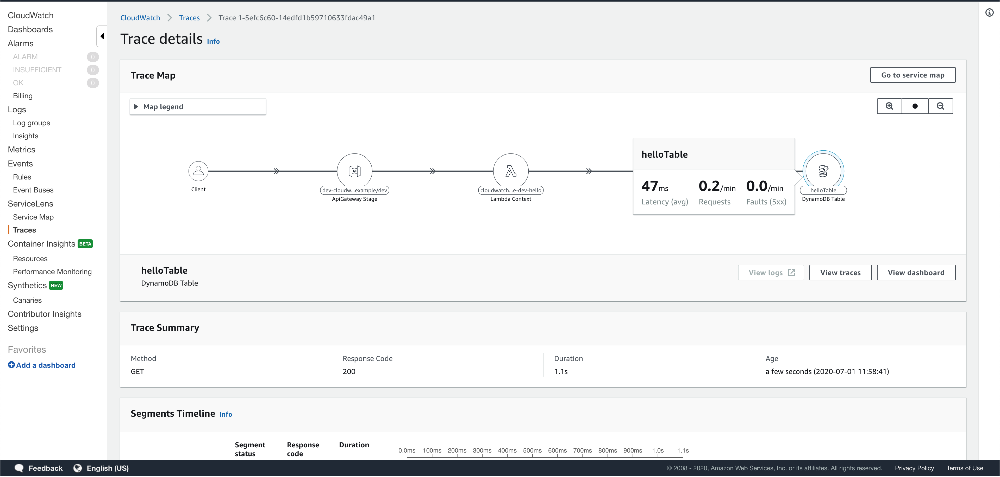
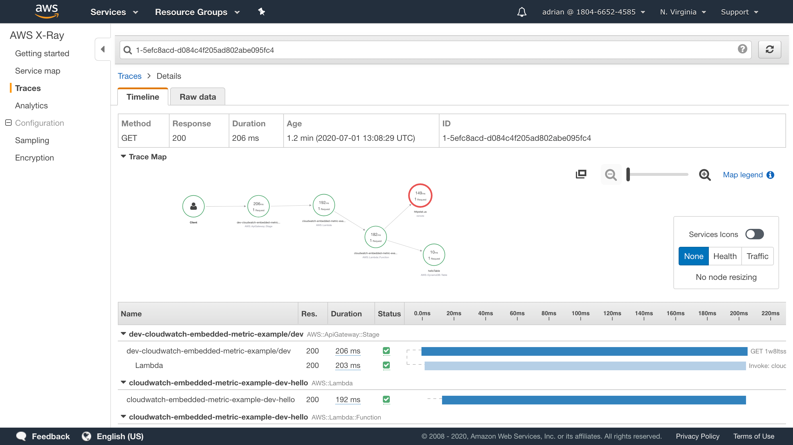
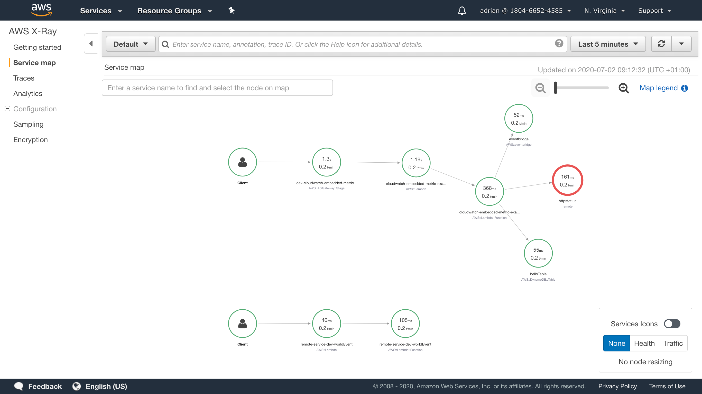
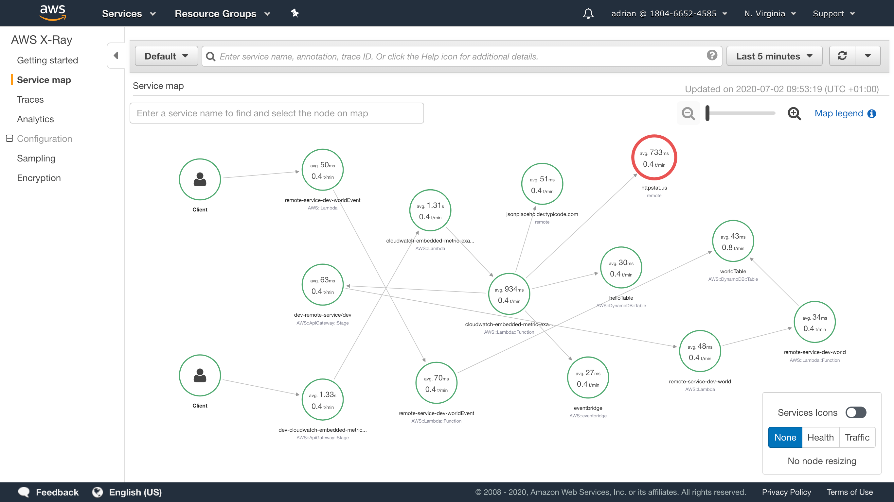

# CloudWatch Embedded Metric Log Format example

TypeScript demonstration of:

* Logging remote fetch calls.
* Using CloudWatch Embedded Metric Format logging.

```shell
$ curl https://xxxxxxx.execute-api.us-east-1.amazonaws.com/dev/hello
{"ok":true}
```

```shell
$ sls logs -f hello
```

```json
{
  "LogGroup": "cloudwatch-embedded-metric-example-dev-hello",
  "ServiceName": "cloudwatch-embedded-metric-example-dev-hello",
  "ServiceType": "AWS::Lambda::Function",
  "executionEnvironment": "AWS_Lambda_nodejs12.x",
  "memorySize": "1024",
  "functionVersion": "$LATEST",
  "logStreamId": "2020/06/30/[$LATEST]7911efa4cd834085934f4b2cb9a708b2",
  "_aws": {
    "Timestamp": 1593525843620,
    "CloudWatchMetrics": [
      {
        "Dimensions": [["LogGroup", "ServiceName", "ServiceType"]],
        "Metrics": [
          { "Name": "expectedFailure_fetchStatus", "Unit": "None" },
          {
            "Name": "expectedFailure_fetchResponseTime",
            "Unit": "Milliseconds"
          },
          { "Name": "expectedOk_fetchStatus", "Unit": "None" },
          { "Name": "expectedOk_fetchResponseTime", "Unit": "Milliseconds" },
          { "Name": "helloFunction_handlerStatus", "Unit": "None" },
          {
            "Name": "helloFunction_handlerResponseTime",
            "Unit": "Milliseconds"
          }
        ],
        "Namespace": "aws-embedded-metrics"
      }
    ]
  },
  "expectedFailure_fetchStatus": 500,
  "expectedFailure_fetchResponseTime": 191.48009,
  "expectedOk_fetchStatus": 200,
  "expectedOk_fetchResponseTime": 54.12774,
  "helloFunction_handlerStatus": 200,
  "helloFunction_handlerResponseTime": 246.77472
}
```

# Metrics

Aside from the standard Lambda metrics:


The new custom metrics are automatically created:


# Logs

Logs can be analysed using AWS Log Insights. Data can be extracted from these logs on an-adhoc basis, allowing the answers to questions like "how many errors did customer A see?", or "how many times did a customer add both item A and item B to their basket?".

The payment model is based on how much log data is scanned.


# AWS X-Ray

By adding in the AWS SDK, it's possible to see the results of all downstream AWS SDK API calls.



# HTTP instrumentation

The service map can be updated to include the two outbound HTTP requests, by using the AWS SDK.



# Traversing message queues

If I add some code in to send a message to EventBridge, and an additional handler that receives it, you might expect the visualisation to pass through EventBridge and start the new Lambda.

However, you only see this behaviour from Lambda to API Gateway or another Lambda.



# Let's prove the Lambda to Lambda works OK

Via the API Gateway, it works well, you can see the trace traverse the two services, however the display is fairly complex. 

The whole thing is triggered by a `curl` request to the API Gateway `dev-cloudwatch-embedded-metric-example/dev`. This triggers the Lambda `cloudwatch-embedded-metric-example-dev-hello` which makes several HTTP requests, including one to an API Gateway endpoint `dev-remote-service/dev`, API Gateway supports tracing, so there's no "Client" segment on the graph for that. However, the `cloudwatch-embedded-metric-example-dev-hello` Lambda also sends a message to EventBridge. EventBridge doesn't support passing the X-Ray tracing information through, so there's a new "Client" on the diagram. This represents the EventBridge message sent by `cloudwatch-embedded-metric-example-dev-hello` triggering the `remote-service-dev-worldEvent` Lambda.

X-Ray makes something of a hash of rendering what's going on:


